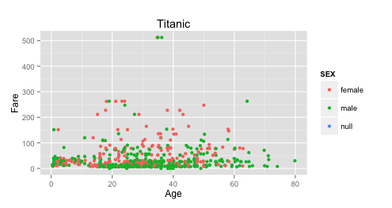
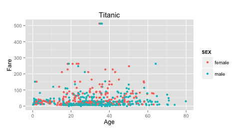
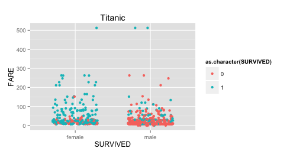
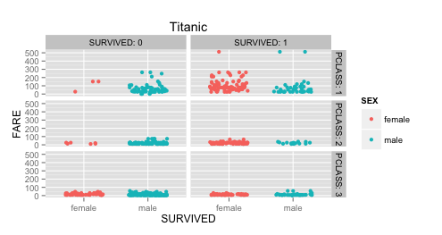
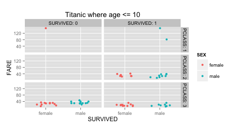
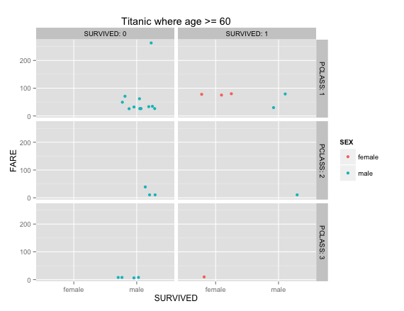

Project 1
===

How does the price of bording passes sold for the Titanic correlate to suvival outcomes?

**The Titanic sunk on April 15, 1912 along with over 1,500 men, women, and children.**
  
In order to create this visualization, age and fare are used as measures, and the color of each point plot is determined by the sex of the corresponding passanger.
  
 
  
This plot is very similar to the previous one, except only male and female genders are plotted. This is done by specifying in SQL "select * from titanic where gender is not null"
  
 
  
Males were slighly less likely to survive, as lifeboats were scarece and seats were reserved for women and chlidren.
  
  
This visualization plots gender along the x-axis as a discrete variable (male or female), with the Fare price mapped along the y-axis. The color of each point plot is determined by the survival (or lack there of) of the corresponding passanger.
  
 
  
This visualization divides the previous graphic into six seperate graphs, ploting gender, Fare, and the corresponding class of the passanger. The color of each point plot is determined by the gender of the corresponding passanger.
  
  
This representation shows men were in the first class were alot more likely to survive than men in the second or third class.
  
 
  
For this visualization we further specified the dataset of the previous plot, limiting ourselves to passangers with ages <= 10. The color of each point plot is determined by the survival (or lack there of) of the corresponding passanger.
  
  
This representation shows most of the children survived, regardless of the class of their ticket.
  
 
  
This visualization was similar to the last, except this time we wanted to see how the elderly fared aboard the sinking ship. We plotted gender, fare, and the corresponding class of the passanger, but limited the scope of the passangers to those whose ages >= 60. The color of each point plot is determined by the survival (or lack there of) of the corresponding passanger.
  
  
This representation shows most of the elderly did not survive the accident, but those who did survive were likely to have been first-class passangers. 
  
 
